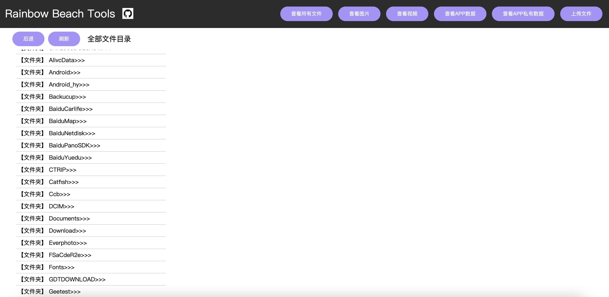
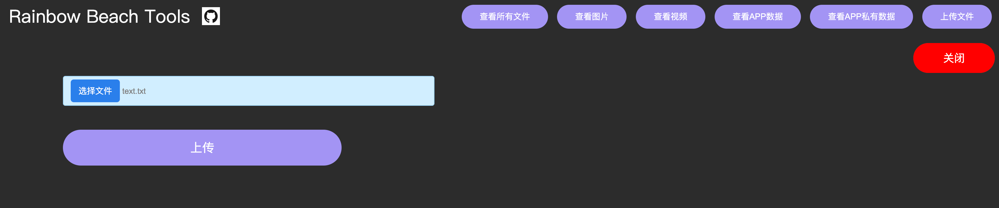
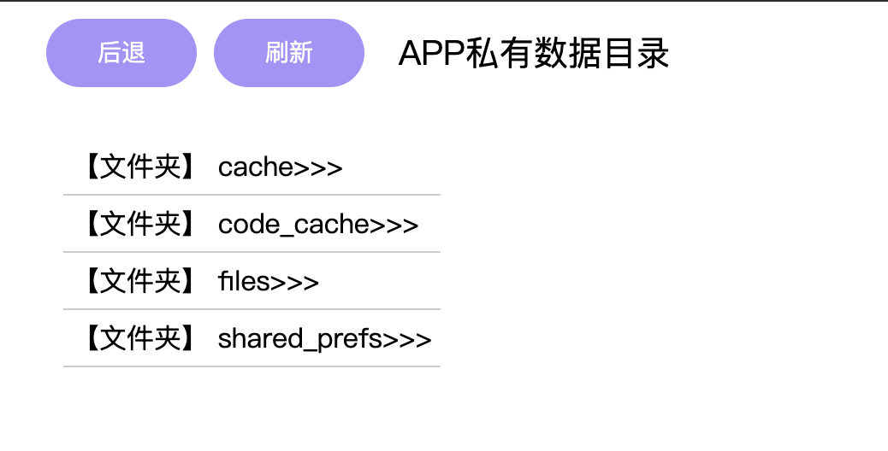
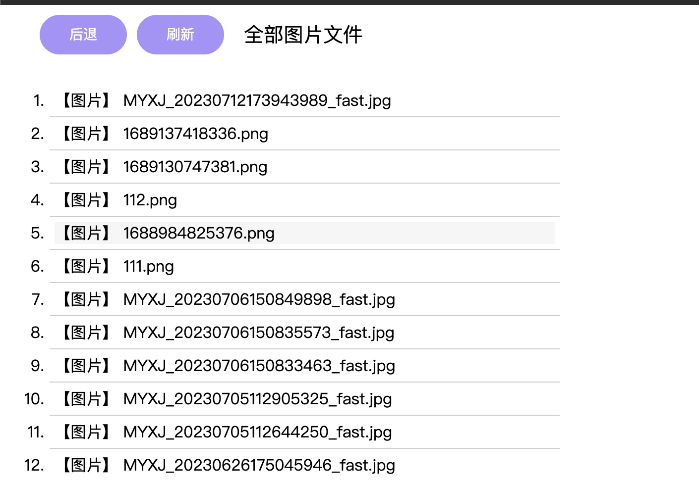
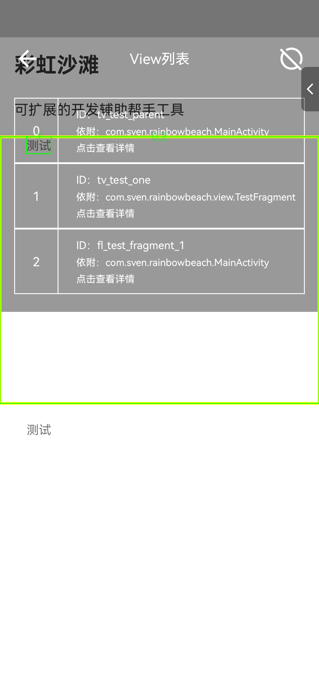
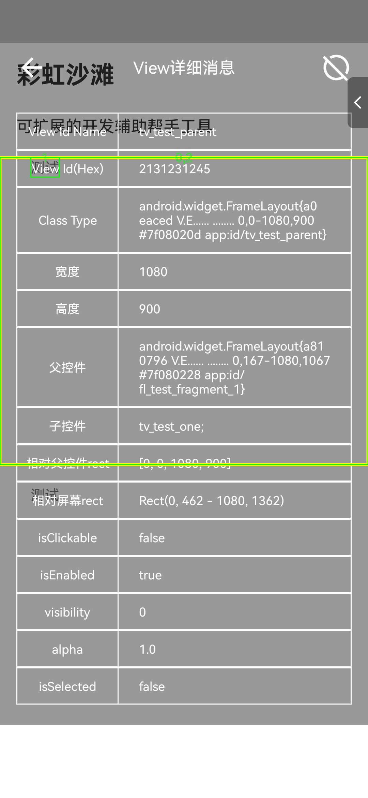
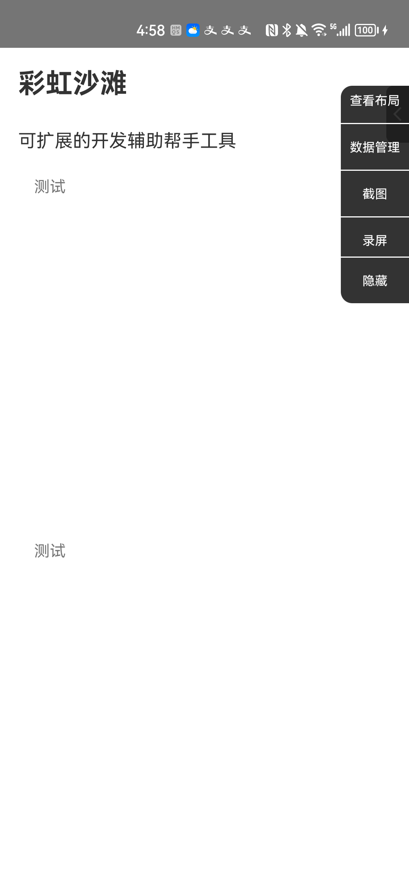

# Rainbow Beach Tools


**一个安卓手机开发者工具类。主要包含以下几点功能特色：**

- **在线网页查看、下载、上传文件等方式管理手机存储；**
- **手动轻松点击屏幕即可查看页面对应View的详细信息；**
- **支持手机上运行ADB命令，一键截图、录屏；**


## 怎么用

1. 添加下面依赖，最新版1.0.4；

2. 调用方法 RainbowBeach.start(activity)

   

```groovy
dependencies {
	        implementation 'com.github.sven-xie:RainbowBeach:Tag'
	}
```

一个安卓手机开发者工具类。主要包含以下几点功能特色：


## 查看和管理手机存储

- 可查看手机所有外部存储文件；

- 查看APP内部数据（cache、file等）、APP私有目录数据（如SP文件等）；

- 可在线点击查看和下载图片和视频文件；无需手动通过第三方软件（微信或者adb等方式）传输导出到电脑端；另上面可被查看到的文件均可一键点击下载到电脑；

- 一键上传文件导入到手机内部存储；

  

  






## 查看页面View树布局信息

日常开发中，遇到不大熟悉但布局又很复杂凌乱的Activity，一般的做法是根据View控件的一些可知信息（如文本内容），先模糊查找定位控件的ID信息，然后定位到具体的代码逻辑位置；整个过程耗时又费力。

如果可在界面点击即可获取到对应的控件详细信息呢，通过拿到点击的坐标，和Activity内所有的View的Rect边框做遍历；得到与点击位置重叠的所有View的的详细；可手动切换查看其他边框和详细列表信息；






## 支持手机上运行ADB命令，一键截图、录屏

在手机开启开发者模式，并开启tcpip 5555端口；即可在手机上运行adb命令



